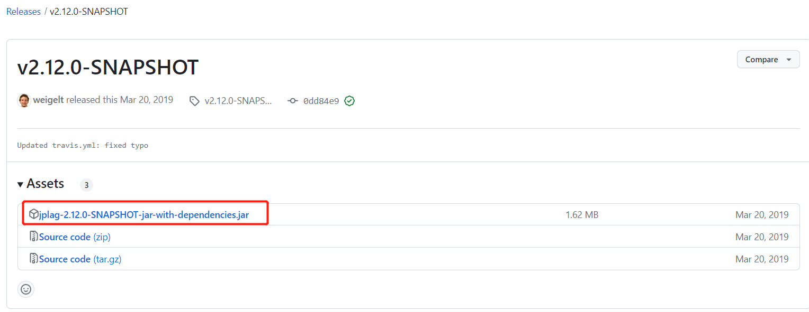
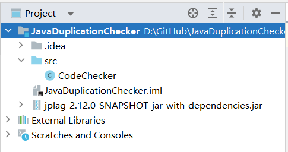

# JavaCodeDuplicationChecker
## 这是什么？

这是一个简单的Java查重脚本，是对[JPlag库](https://github.com/jplag/JPlag)一层简单封装。

## 应用范围？

可以应用于南方科技大学本科所有Java语言类型的查重功能，包括但不限于：

- CS102A/CS102B/CS107/CS109/CS110：计算机程序设计基础A/B及其衍生课程
- CS203：数据结构与算法分析
- CS208：算法设计与分析
- CS209A：计算机系统设计与应用
- CS307：数据库原理
- CS309：面向对象分析与设计

## 如何使用？

第一步：从[此处](https://github.com/jplag/JPlag/releases/tag/v2.12.0-SNAPSHOT)下载Jplag v2.12.0 SNAPSHOT的源代码，并放入IDEA的工程目录中。

第二步：下载该脚本的源代码，并放入IDE工程中，配置好了以后应当是一个这样的目录结构：

第三步：在IDE里配置目录结构

