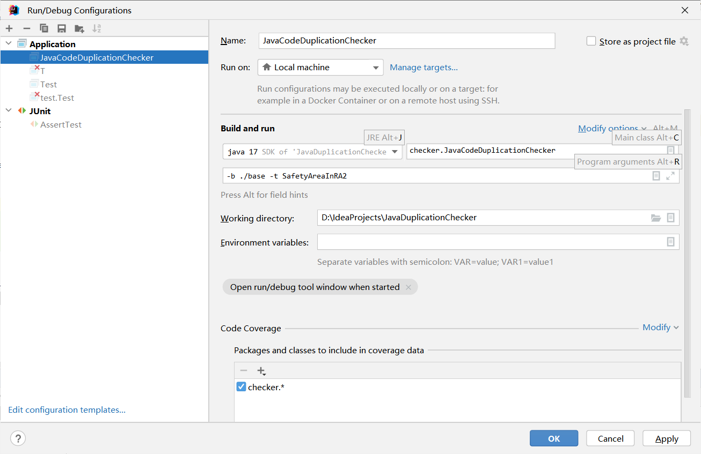
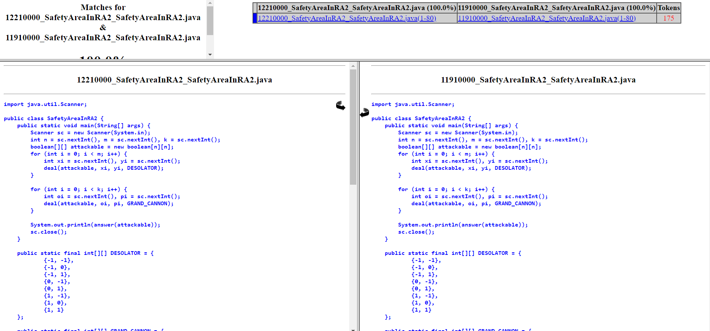

# JavaCodeDuplicationChecker
## 这是什么？

这是一个简单的Java查重脚本，是对[JPlag库](https://github.com/jplag/JPlag)一层简单封装。

## 应用范围？

可以应用于南方科技大学本科所有Java语言类型的查重功能，包括但不限于：

- CS102A/CS102B/CS107/CS109/CS110：计算机程序设计基础A/B及其衍生课程
- CS203：数据结构与算法分析
- CS208：算法设计与分析
- CS209A：计算机系统设计与应用
- CS307：数据库原理
- CS309：面向对象分析与设计

## 如何使用？

### 第一步：配置项目依赖

1. Maven工程中加入如下依赖以导入[Apache Command Line CLI](https://github.com/apache/commons-cli)：

```maven
<dependency>
	<groupId>commons-cli</groupId>
	<artifactId>commons-cli</artifactId>
	<version>1.5.0</version>
</dependency>
```

2. 由于JPlag新版本的实用性不如老版本，且老版本在maven库中已经被移除，因此我们需要通过jar包导入Jplag v2.12.0 SNAPSHOT的源码：

①从[此处](https://github.com/jplag/JPlag/releases/tag/v2.12.0-SNAPSHOT)下载的源代码，并放入IDEA的工程目录中。


②下载该脚本的源代码，并放入IDE工程中，配置好了以后应当是一个这样的目录结构：


3. 配置需要查重的代码的目录结构，最终需要是一个`base-sid-targetPackage`的**三层结构**。举个例子来说，我将`base`文件夹设置为基础文件夹，`sid`分别是`11910000`，`12010000`，`12110000`，`12210000`，`targetPackage`是`SafetyAreaInRA2`。注：这个`targetPackage`不一定要和源代码文件名称一样，但需要所有学生的目录名称都保持统一。

使用`tree`命令得到的效果如下：

```
D:\IdeaProjects\JavaDuplicationChecker>tree ./base /f
卷 Data 的文件夹 PATH 列表
卷序列号为 00000074 862D:B4B8
D:\IDEAPROJECTS\JAVADUPLICATIONCHECKER\BASE
├─11910000
│  └─SafetyAreaInRA2
│          SafetyAreaInRA2.java
│
├─12010000
│  └─SafetyAreaInRA2
│          SafetyAreaInRA2.java
│
├─12110000
│  └─SafetyAreaInRA2
│          SafetyAreaInRA2.java
│
└─12210000
    └─SafetyAreaInRA2
            SafetyAreaInRA2.java
```

在IDEA中的效果如下：


4. 配置IDEA中的命令行参数，详细信息如下。

   ```
   usage: CommandLine Example:
    -a,--all            check all problem subDirectories
    -b,--base <arg>     base directory
    -o,--output <arg>   result output file
    -t,--target <arg>   result target file
   ```

   例如：



5. 在IDEA中运行，可以看到有查重结果：



